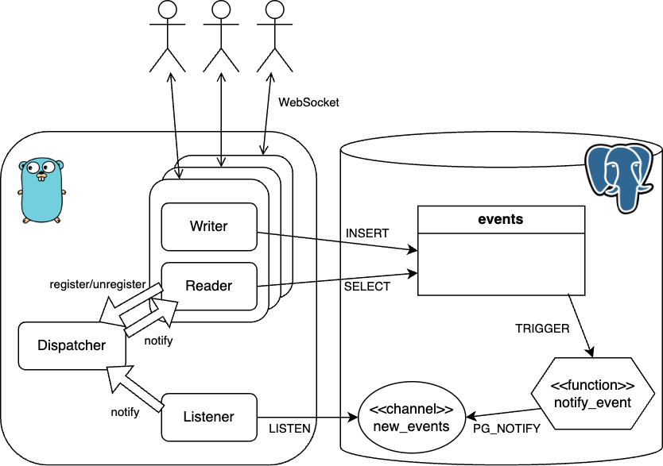

# pg_notify_sample

Example of real-time messaging using Go, PostgreSQL LISTEN/NOTIFY, and WebSocket.

## Overview



## Usage

Use [websocat](https://github.com/vi/websocat) as WebSocket client.

```sh
# launch
docker compose up
go run .
```

```sh
# Alice
websocat 'ws://localhost:8080/ws?room_id=e5c87218-676b-4185-9335-3fe48eff6a38'
{"foo", "bar"} # send JSON message
```

```sh
# Bob
websocat 'ws://localhost:8080/ws?room_id=e5c87218-676b-4185-9335-3fe48eff6a38'
# {"foo", "bar"} # receive JSON message
```
